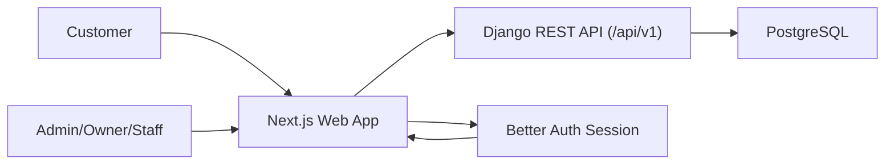
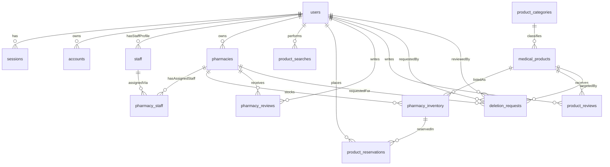

# Terms of Reference (TOR)
## Centralized Medical Product Finder Using PostgreSQL

## 1. Introduction

### 1.1 Background
MedFinder is a centralized medical product discovery and pharmacy management system built as a web-first platform. It supports customer product discovery, pharmacy operations, and role-based dashboards for administrators, pharmacy owners, and staff.

The current implementation uses:
- `apps/web` (Next.js) for customer and dashboard UI.
- `apps/backend` (Django REST Framework) for API services.
- PostgreSQL for persistence.
- `packages/db/src/schema.ts` (Drizzle schema) as the shared data model contract.

### 1.2 Purpose
This Terms of Reference defines:
- User-based access control and responsibilities.
- Functional modules and their scope.
- Data schema relationships and ownership rules.
- Core workflows and governance requirements.

### 1.3 Scope
This TOR covers:
- Web application modules (customer and dashboard).
- API-backed role-based operations.
- Database entities and relationships for core business data.

This TOR excludes:
- Deployment pipeline details.
- Infrastructure runbooks.
- Vendor-specific operations outside the system boundary.

## 2. Specific Objectives

1. To identify and collect essential data such as medicine details, prices, quantities, and supplier information in the customer-facing part of the system.
2. To develop a web-based platform with features for searching medicines and medical supplies, viewing real-time availability, locating nearby pharmacies, and managing supplier/pharmacy inventories.
   - 2.1 To develop search functionality that allows users to efficiently find medical products by name, brand, category, and related fields.
   - 2.2 To display accurate and relevant search results using PostgreSQL Full-Text Search, helping users quickly access medical product information.
3. To implement PostgreSQL Full-Text Search for fast and relevant search results.

## 3. System Overview

### 3.1 Functional Domains
- Customer discovery and navigation (`find product`, `pharmacy details`, product/pharmacy reviews).
- Pharmacy and inventory management (owner/staff dashboards).
- Platform oversight (admin dashboards and governance sections).
- Authentication and role-based route protection.

### 3.2 High-Level Architecture

## 4. User Roles and Access Control

### 4.1 Role Definitions
- `admin`: Platform-level governance user with cross-tenant visibility and management capability.
- `owner`: Pharmacy business owner; manages owned pharmacies, inventory-relevant modules, and staff under owner scope.
- `staff`: Operational user assigned under owner/pharmacy context; performs day-to-day product/inventory tasks.
- `customer`: End user focused on discovery, viewing availability, and submitting reviews/reservations.

### 4.2 Route and Session Control
- Dashboard routes are protected by authentication middleware.
- Dashboard route groups are role-gated:
  - `/dashboard/admin/*` for `admin`
  - `/dashboard/owner/*` for `owner`
  - `/dashboard/staff/*` for `staff`
- Non-dashboard users (including `customer`) are redirected away from unauthorized dashboard sections.

### 4.3 Access Matrix (Module-Level)

| Module / Section | Admin | Owner | Staff | Customer |
|---|---|---|---|---|
| Dashboard Overview | Full platform view | Owned-business view | Assigned operational view | No dashboard |
| User Management | C/R/U/D (platform scope) | R/U (operational/support scope) | No | Self account use only |
| Pharmacy Management | C/R/U/D (all pharmacies) | C/R/U/D (owned pharmacies only) | Read assigned context | Browse public pharmacy info |
| Product Monitoring / Product Mgmt | Global monitoring and policy | Manage product records relevant to owned operations | Manage assigned product operations | Search and view |
| Inventory | Global monitoring/oversight | Manage inventory of owned pharmacies | Update and monitor assigned inventory | View availability |
| Staff Management | Read and governance support | C/R/U/D staff under owner scope | Read own/assigned context | No |
| Reviews & Ratings | Oversight/moderation | View/respond for owned pharmacies/products | View assigned context | Create and view reviews |
| Reports & Analytics | Platform analytics | Owner analytics | Staff analytics/reports | No |
| Audit Logs | Full | Owner scope | Limited/none (policy-defined) | No |
| Settings | Platform settings | Business settings | Operational preferences | Profile preferences |
| Reservations | Oversight and policy | Operational handling for owned inventory | Operational handling for assigned inventory | Create/manage own reservations |
| Deletion Requests | Review/approve/reject | Create and review per policy | Create (if allowed by policy) | No |

Legend: `C/R/U/D` = Create, Read, Update, Delete.

### 4.4 Ownership and Row-Level Rules
- Owner scope: owner can only modify records tied to their own user ID or owned entities (`owner_id`, related pharmacy chain).
- Staff scope: staff actions are limited to assigned and authorized pharmacy/business context.
- Customer scope: customer can create interaction records (reviews/reservations/search logs) tied to own account.
- Admin scope: admin can access cross-tenant data for governance and support.

### 4.5 CMO and Equivalent Executive Functions
If the organization uses a Chief Medical Officer (CMO) role, it should map to either:
- `owner` role for strategic/business-wide control, or
- `staff` role with elevated policy permissions and a `position` value such as `CMO`.

Recommendation:
- Keep `role` for coarse RBAC (`admin|owner|staff|customer`).
- Use `department`/`position` for finer business titles (e.g., CMO, Head Pharmacist), then enforce additional policy checks in service layer.

## 5. Module Catalogue and Responsibilities

### 5.1 Admin Modules
- Dashboard: monitor platform metrics and cross-module health.
- User Management: manage user profiles, role assignments, and governance checks.
- Pharmacy Management: manage pharmacy profiles, activity state, and platform visibility.
- Product Monitoring: oversee products across pharmacies and compliance quality.
- Reviews & Ratings: monitor feedback quality and moderation workflows.
- Reports & Analytics: review platform-wide trends and KPIs.
- Audit Logs: inspect critical actions and decision trails.
- Settings: configure platform-level operational policies.

### 5.2 Owner Modules
- Dashboard: monitor owned pharmacy performance and risk indicators.
- My Pharmacies: manage pharmacy records, contact/location metadata, and active state.
- Product Management: manage business-relevant product set and listing quality.
- Inventory: maintain stock levels, pricing, availability, and restock tracking.
- Staff Management: create, update, deactivate, and remove staff profiles.
- Reviews: monitor and respond to customer feedback on owned entities.
- Analytics: evaluate owner-specific trends and operational outcomes.
- Audit Logs: review owner-scope traceability events.
- Settings: configure owner/business-level settings.

### 5.3 Staff Modules
- Dashboard: monitor assigned operational KPIs.
- Products: view and maintain product entries in assigned context.
- Stock Alerts: track low-stock/out-of-stock signals and respond promptly.
- Reports: review stock and sales-related operational outputs.

### 5.4 Customer Modules
- Product Search: query by name, brand, category, and filter by location/store.
- Product Detail: view product attributes, pricing, and linked pharmacies.
- Pharmacy Detail: view pharmacy information, map/location, and available products.
- Reviews: submit and read product and pharmacy reviews.
- Reservations: reserve available inventory where enabled by workflow.

## 6. Data Model and Table Relationships

### 6.1 Core Table Inventory

### Identity and Authentication
- `users`: master user profile and role.
- `sessions`: active login sessions linked to users.
- `accounts`: auth provider account linkage per user.
- `verifications`: token/value verification artifacts.

### Organization and Operations
- `staff`: staff profile linked to user and owner.
- `pharmacies`: pharmacy master record linked to owner.
- `pharmacy_staff`: assignment bridge between pharmacies and staff.

### Product and Inventory
- `product_categories`: product category taxonomy.
- `medical_products`: product master data linked to category.
- `pharmacy_inventory`: pharmacy-stock listing linked to pharmacy and product.

### Customer Interaction
- `product_searches`: search telemetry and keyword events.
- `product_reservations`: reservation transaction linked to customer and inventory.
- `pharmacy_reviews`: pharmacy feedback linked to user and pharmacy.
- `product_reviews`: product feedback linked to user and product.
- `deletion_requests`: controlled product-removal request and review trail.

### 6.2 Relationship Detail Per Table

- `users`
  - References: none.
  - Referenced by: `sessions.user_id`, `accounts.user_id`, `staff.user_id`, `staff.owner_id`, `pharmacies.owner_id`, `product_searches.customer_id`, `product_reservations.customer_id`, `pharmacy_reviews.user_id`, `product_reviews.user_id`, `deletion_requests.requested_by`, `deletion_requests.reviewed_by`.

- `sessions`
  - References: `users.id` via `user_id` (cascade delete).
  - Referenced by: none.

- `accounts`
  - References: `users.id` via `user_id` (cascade delete).
  - Referenced by: none.

- `verifications`
  - References: none.
  - Referenced by: none.

- `staff`
  - References: `users.id` via `user_id`, `users.id` via `owner_id` (cascade delete).
  - Referenced by: `pharmacy_staff.staff_id`.

- `pharmacies`
  - References: `users.id` via `owner_id` (cascade delete).
  - Referenced by: `pharmacy_staff.pharmacy_id`, `pharmacy_inventory.pharmacy_id`, `pharmacy_reviews.pharmacy_id`, `deletion_requests.pharmacy_id`.

- `pharmacy_staff`
  - References: `pharmacies.id` via `pharmacy_id` (cascade delete), `staff.id` via `staff_id` (cascade delete).
  - Referenced by: none.

- `product_categories`
  - References: self-link field `parent_category_id` (logical hierarchy).
  - Referenced by: `medical_products.category_id`.

- `medical_products`
  - References: `product_categories.id` via `category_id` (restrict delete).
  - Referenced by: `pharmacy_inventory.product_id`, `product_reviews.product_id`, `deletion_requests.product_id`.

- `pharmacy_inventory`
  - References: `pharmacies.id` via `pharmacy_id` (cascade delete), `medical_products.id` via `product_id` (restrict delete).
  - Referenced by: `product_reservations.inventory_id`.

- `product_searches`
  - References: `users.id` via `customer_id` (nullable, cascade delete when set).
  - Referenced by: none.

- `product_reservations`
  - References: `users.id` via `customer_id` (cascade delete), `pharmacy_inventory.id` via `inventory_id` (cascade delete).
  - Referenced by: none.

- `pharmacy_reviews`
  - References: `pharmacies.id` via `pharmacy_id` (cascade delete), `users.id` via `user_id` (cascade delete).
  - Referenced by: none.

- `product_reviews`
  - References: `medical_products.id` via `product_id` (cascade delete), `users.id` via `user_id` (cascade delete).
  - Referenced by: none.

- `deletion_requests`
  - References: `medical_products.id` via `product_id` (cascade delete), `pharmacies.id` via `pharmacy_id` (cascade delete), `users.id` via `requested_by` (cascade delete), `users.id` via `reviewed_by` (set null).
  - Referenced by: none.

### 6.3 ER Diagram (Core Business Relationships)

### 6.4 Data Integrity and Constraints
- Unique constraints:
  - `users.email` unique.
  - `product_categories.name` unique.
  - `sessions.token` unique.
- Composite keys:
  - `accounts`: composite primary key on `provider_id + account_id`.
  - `verifications`: composite primary key on `identifier + value`.
- Referential behavior:
  - Cascades for dependent records in sessions, ownership links, and many interactions.
  - Restrict deletes for product-category and inventory-product integrity.
  - `deletion_requests.reviewed_by` sets null when reviewer is removed.
- Index strategy includes lookups for owner/staff scope, availability flags, status, and chronology.

## 7. Workflow Definitions

### 7.1 Product Discovery and Search
1. Customer submits search query (name/brand/category etc.).
2. System filters products and availability by pharmacy/location.
3. Search events may be logged to `product_searches` for analytics.
4. Result detail pages provide product and pharmacy drill-down.

### 7.2 Reservation Lifecycle
1. Customer creates reservation for an inventory record.
2. Reservation is stored in `product_reservations` with status (e.g., pending/confirmed/cancelled/completed).
3. Owner/staff operational flow updates reservation status.
4. Expiry and completion logic closes the reservation lifecycle.

### 7.3 Review and Rating Lifecycle
1. Customer submits product or pharmacy review.
2. Review is persisted in `product_reviews` or `pharmacy_reviews`.
3. Average rating and review counts are calculated for display.
4. Owner/admin modules provide oversight and response/moderation workflows.

### 7.4 Product Deletion Request Lifecycle
1. Authorized user submits deletion request with reason.
2. Request is stored in `deletion_requests` as `pending`.
3. Reviewer approves/rejects and status is updated with `reviewed_by`.
4. Audit trail remains for governance and traceability.

## 8. Non-Functional and Governance Requirements

### 8.1 Security and Access Control
- Enforce RBAC at route, API, and data-scope levels.
- Maintain ownership checks for owner-scoped modifications.
- Restrict customer operations to own identity records.

### 8.2 Search Performance Requirement
- PostgreSQL Full-Text Search shall be implemented for product discovery to satisfy Objectives 2.2 and 3.
- Ranking and relevance tuning shall prioritize medical product discoverability and user intent.

### 8.3 Auditability
- Critical actions (delete requests, role changes, inventory status changes) should be auditable.
- Timestamp fields (`created_at`, `updated_at`) must be preserved for traceability.

### 8.4 Reliability and Data Quality
- Data updates should preserve referential integrity and ownership boundaries.
- Search, inventory, and reservation data should reflect current operational state.

## 9. Assumptions and Notes
- Role taxonomy is currently fixed to `admin`, `owner`, `staff`, `customer`.
- Some dashboard sections are currently placeholders in UI but are included as required TOR modules.
- Business titles like CMO are represented through `staff.position`/`staff.department` unless promoted to coarse RBAC role.
- This TOR is based on current repository implementation and schema contract.
